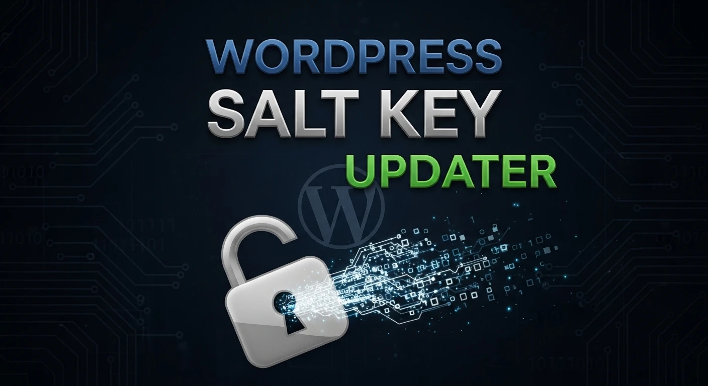

# WP Salt Key Updater

Readme: [EN](README.md)

 



O **WP Salt Key Updater** é um utilitário em linha de comando desenhado para fortalecer a segurança de sites WordPress. Ele automatiza a geração e a substituição das chaves secretas e `salts` no ficheiro `wp-config.php`, garantindo que todas as sessões ativas sejam invalidadas e que a criptografia de cookies seja renovada.

## Por que usar?

As chaves de segurança do WordPress (`AUTH_KEY`, `SECURE_AUTH_KEY`, etc.) tornam o seu site mais difícil de hackear ao adicionar caracteres aleatórios às palavras-passe. É uma boa prática de segurança alterar estas chaves periodicamente ou imediatamente após uma suspeita de invasão.

## Funcionalidades

- **Automação Completa**: Substitui as chaves antigas pelas novas de forma automática.
- **Integração com API Oficial**: Obtém chaves aleatórias e seguras diretamente do `WordPress.org`.
- **Preservação de Estrutura**: O script identifica o bloco de chaves no seu `wp-config.php` e substitui apenas o necessário, sem corromper outras configurações.
- **Segurança**: Invalida instantaneamente todos os logins ativos, forçando uma nova autenticação (útil para expulsar usuários indesejados).

## Requerimentos
- **Python** 3 ou superior instalado
- Arquivo **wp-config.php** existente no mesmo diretorio do script.
- Permissões de escrita no arquivo **wp-config.php**.
- Ferramentas `curl` ou `wget` instaladas no servidor.

## Instalação e Uso

1. **Baixe o arquivo no servidor:**

```bash
curl -O https://raw.githubusercontent.com/sr00t3d/wpsaltkey/refs/heads/main/saltkey.py
```

2. **Dê permissão de execução:**

```bash
chmod +x saltkey.py
```

3. **Execute o script:**

```bash
python3 saltkey.py
```

Exemplo:

```bash
python3 saltkey.py 
Fetching fresh security keys from WordPress API...
Creating backup of original file to 'wp-config.php.bak'...
Updating keys in configuration file...

SUCCESS: Security keys have been updated!
```

Chaves atualizadas:

```bash
grep WORDPRESS_ wp-config.php | grep -v DB
define( 'WORDPRESS_AUTH_KEY',         '90933cfe29f8770697119865778e1d60dd4bff8e');
define( 'WORDPRESS_SECURE_AUTH_KEY',  '400e6e51c39c99a15a01aec7df51b27f13674b1f');
define( 'WORDPRESS_LOGGED_IN_KEY',    '2052ee4109f2f2e824b66bf48af4510ee09e6ad4');
define( 'WORDPRESS_NONCE_KEY',        'cbf477490d8d0511a03a9870242a93b9c2c7bf7f');
define( 'WORDPRESS_AUTH_SALT',        '018e7801dc9ef3dfda43b2a31cff57883b5415a9');
define( 'WORDPRESS_SECURE_AUTH_SALT', 'f7430b5f413fa74d535aa376a7923371586e7141');
define( 'WORDPRESS_LOGGED_IN_SALT',   '07fd3a50583ea1b5acaa66364c4a8f3267e8321c');
define( 'WORDPRESS_NONCE_SALT',       '109224268d2524142552f89e55b4803e18f7aca5');
```

## Aviso de Segurança

> [!WARNING]
> Importante: Este script altera um ficheiro crítico do sistema. Recomendamos fortemente a realização de um backup do seu wp-config.php antes de executar a ferramenta. Ao alterar as chaves, todos os utilizadores (incluindo o administrador) serão desconectados do painel /wp-admin.
> O script cria um backup automatizado antes de executar.

## Aviso Legal

> [!WARNING]
> Este software é fornecido "tal como está". Certifique-se sempre de ter permissão explícita antes de executar. O autor não se responsabiliza por qualquer uso indevido, consequências legais ou impacto nos dados causados ​​por esta ferramenta.

## Detailed Tutorial

Para um guia completo, passo a passo, confira meu artigo completo:

👉 [**Change WordPress Keys for security**](https://perciocastelo.com.br/blog/change-wordPress-keys-for-security.html)

## Licença

Este projeto está licenciado sob a **GNU General Public License v3.0**. Consulte o arquivo [LICENSE](LICENSE) para mais detalhes.