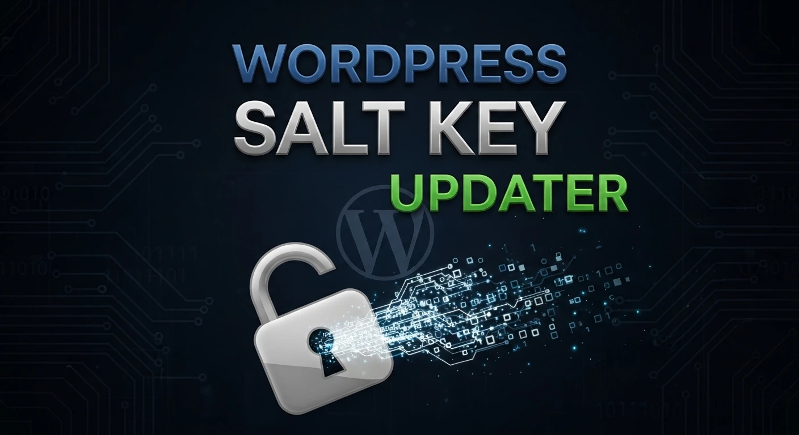

# WP Salt Key Updater 🔐

Readme: [BR](README-ptbr.md)




The **WP Salt Key Updater** is a command-line utility designed to strengthen the security of WordPress sites. It automates the generation and replacement of secret keys and `salts` in the `wp-config.php` file, ensuring that all active sessions are invalidated and cookie encryption is refreshed.

## ❓ Why use it?

WordPress security keys (`AUTH_KEY`, `SECURE_AUTH_KEY`, etc.) make your site harder to hack by adding random characters to passwords. It is a good security practice to change these keys periodically or immediately after a suspected breach.

## ✨ Features

- **Full Automation**: Automatically replaces old keys with new ones.
- **Official API Integration**: Retrieves random and secure keys directly from `WordPress.org`.
- **Structure Preservation**: The script identifies the key block in your `wp-config.php` and replaces only what is necessary, without corrupting other settings.
- **Security**: Instantly invalidates all active logins, forcing re-authentication (useful for expelling unwanted users).

## 📋 Requirements
- **Python** 3 or higher installed  
- Existing **wp-config.php** file in the same directory as the script.  
- Write permissions for the **wp-config.php** file.  
- `curl` or `wget` tools installed on the server.

## 🚀 Installation and Usage

1. **Download the file to the server:**

```bash
curl -O https://raw.githubusercontent.com/sr00t3d/wpsaltkey/refs/heads/main/saltkey.py
```

2. **Grant execution permission:**

```bash
chmod +x tmp-manager.sh
```

3. **Run the script:**

```bash
./tmp-manager.sh
```

Example:

```bash
python3 saltkey.py 
Fetching fresh security keys from WordPress API...
Creating backup of original file to 'wp-config.php.bak'...
Updating keys in configuration file...

SUCCESS: Security keys have been updated!
```

Updated keys:

```bash
grep WORDPRESS_ wp-config.php | grep -v DB
define( 'WORDPRESS_AUTH_KEY',         '90933cfe29f8770697119865778e1d60dd4bff8e');
define( 'WORDPRESS_SECURE_AUTH_KEY',  '400e6e51c39c99a15a01aec7df51b27f13674b1f');
define( 'WORDPRESS_LOGGED_IN_KEY',    '2052ee4109f2f2e824b66bf48af4510ee09e6ad4');
define( 'WORDPRESS_NONCE_KEY',        'cbf477490d8d0511a03a9870242a93b9c2c7bf7f');
define( 'WORDPRESS_AUTH_SALT',        '018e7801dc9ef3dfda43b2a31cff57883b5415a9');
define( 'WORDPRESS_SECURE_AUTH_SALT', 'f7430b5f413fa74d535aa376a7923371586e7141');
define( 'WORDPRESS_LOGGED_IN_SALT',   '07fd3a50583ea1b5acaa66364c4a8f3267e8321c');
define( 'WORDPRESS_NONCE_SALT',       '109224268d2524142552f89e55b4803e18f7aca5');
```

## ⚠️ Security Warning

> [!WARNING]  
> Important: This script modifies a critical system file. We strongly recommend backing up your wp-config.php before running the tool. When changing the keys, all users (including the administrator) will be logged out of the /wp-admin panel.  
> The script creates an automated backup before executing.

## ⚠️ Legal Notice

> [!WARNING]
> This software is provided "as is". Always ensure you have explicit permission before running. The author is not responsible for any misuse, legal consequences, or data impact caused by this tool.

## 📚 Detailed Tutorial

For a complete, step-by-step guide, check out my full article:

👉 [**Change WordPress keys for security**](https://perciocastelo.com.br/blog/change-wordPress-keys-for-security.html)

## License 📄

This project is licensed under the **GNU General Public License v3.0**. See the [LICENSE](LICENSE) file for more details.
